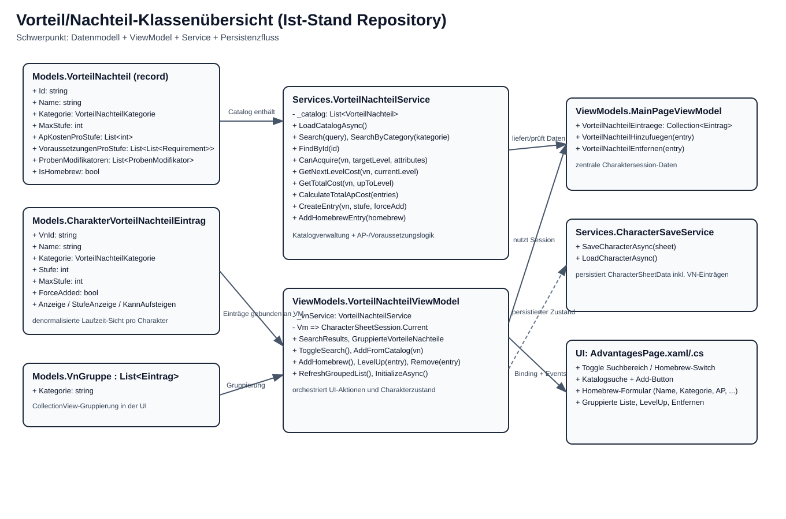
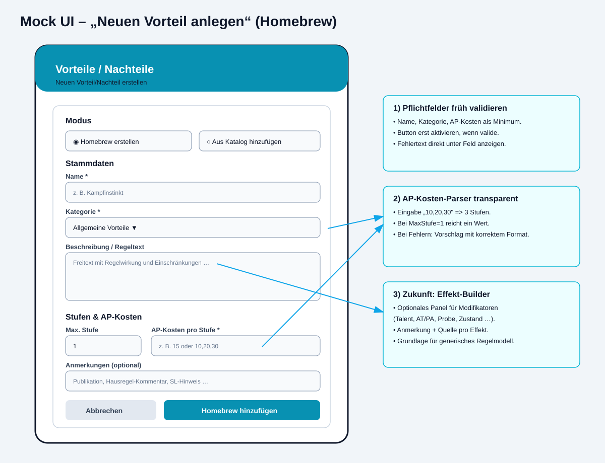

# Aufzeichnung: Klassenbeziehungen + Mock UI für neuen Vorteil

Diese Aufzeichnung dokumentiert den aktuellen Aufbau rund um **Vorteile/Nachteile** und zeigt einen UI-Entwurf für das Anlegen eines neuen Homebrew-Vorteils.

## 1) Klassen und Zusammenhänge (Grafik)

### Kurzleseweise
- `VorteilNachteilService` lädt/verwaltet den Katalog (`vorteile_nachteile.json`), sucht Einträge und berechnet AP-/Voraussetzungslogik.
- `VorteilNachteilViewModel` orchestriert Suche, Homebrew-Erstellung, Gruppierung und Aktionen (Hinzufügen, LevelUp, Entfernen).
- `CharakterVorteilNachteilEintrag` ist die charaktergebundene Instanz eines Katalogeintrags (`VnId` als Referenz auf `VorteilNachteil.Id`).
- `VnGruppe` bildet nur die UI-Gruppierung für die `CollectionView`.
- `MainPageViewModel` hält den zentralen Character-Zustand, in den das VN-ViewModel schreibt.
- `CharacterSaveService` persistiert den Zustand (inkl. VN-Einträge).

## 2) Mock UI: „Neuen Vorteil anlegen“

### UX-Idee
- Oben Modus-Switch (Katalog vs. Homebrew).
- Im Homebrew-Modus fokussierte Pflichtfelder:
  - Name
  - Kategorie
  - AP-Kosten pro Stufe
- Erweiterbare Felder:
  - Beschreibung/Regeltext
  - Max. Stufe
  - Anmerkungen
- Primäraktion „Homebrew hinzufügen“ erst bei validen Pflichtfeldern aktiv.

## 3) Wie laufen Effekte konkret?

Dafür gibt es jetzt eine eigene technische Spezifikation:
- **`EFFEKT_SYSTEM_DESIGN.md`**: trennt klar zwischen
  - `Narrative`-Effekten (nur Beschreibung/Fluff)
  - `Modifier`-Effekten (rechnen konkrete Zielwerte wie `derived.GS`).

Direktlink: [Effekt-System Design](./EFFEKT_SYSTEM_DESIGN.md)

## 4) Nächste sinnvolle Ausbaustufe
1. Feldvalidierung im ViewModel als `CanAddHomebrew` + Fehlertexte pro Feld.
2. Parsing-Feedback für AP-Kosten (inkl. Autoabgleich mit `MaxStufe`).
3. Optionaler „Effekt-Builder“ für regeltechnische Modifikatoren als Basis für das spätere generische Regelsystem.
4. GS- und AT/PA-Werte im UI mit Audit-Tooltip („welcher Effekt hat was geändert?“).

## 5) Ergänzung: Condition-UI & Kontext-UC
Siehe auch: [Conditions UI Konzept](./CONDITIONS_UI_KONZEPT.md) für das Anlegen neuer Conditions und ein wiederverwendbares UC mit manuellen + berechneten Zuständen.
